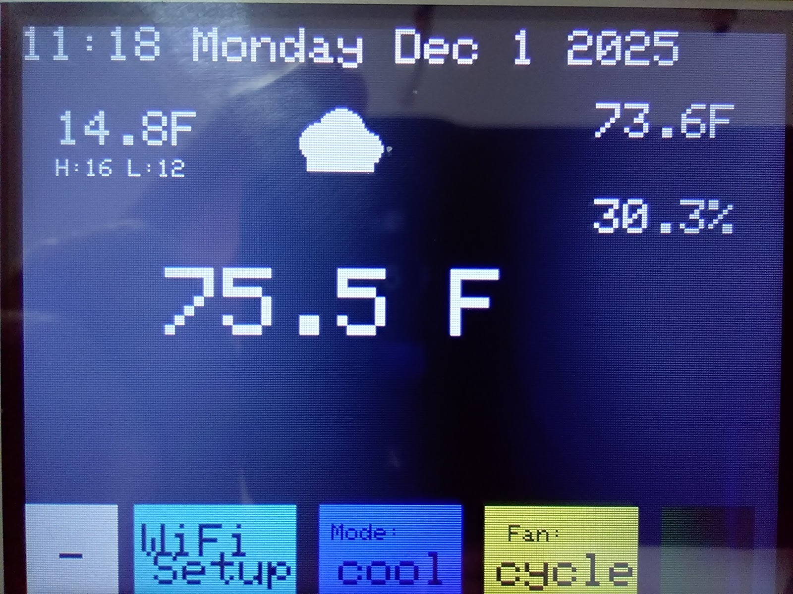

# Smart Thermostat Alt Firmware

A comprehensive, feature-rich smart thermostat system built on the ESP32 platform with professional PCB design. Perfect for DIY smart home automation with full Home Assistant integration.

## 🏗️ Hardware Credits

This project is **alternative firmware** for the excellent smart-thermostat hardware designed by **Stefan Meisner**.

**Original Hardware Project**: https://github.com/smeisner/smart-thermostat

We use Stefan's hardware design and provide an enhanced firmware implementation with advanced features including multi-core architecture, centralized display management, and comprehensive Home Assistant integration.

## 🌟 Key Features

- **📱 Local Touch Control**: ILI9341 TFT LCD with intuitive touch interface
- **🏠 Smart Home Ready**: Full MQTT integration with Home Assistant auto-discovery
- **📅 7-Day Scheduling**: Comprehensive inline scheduling with day/night periods and editable Heat/Cool/Auto temperatures
- **🌡️ Dual Sensors**: AHT20 for ambient conditions + DS18B20 for hydronic systems
- **⚡ Multi-Stage HVAC**: Support for 2-stage heating and cooling systems
- **💨 Advanced Fan Control**: Auto, continuous, and scheduled cycling modes
- **🌤️ Weather Integration**: OpenWeatherMap and Home Assistant weather with color-coded icons on display
- **🌐 Modern Web Interface**: Complete tabbed interface with embedded scheduling - no separate pages
- **📡 Offline Operation**: Full functionality without WiFi connection
- **🔧 Professional PCB**: Custom PCB design for clean, permanent installation
- **🔄 OTA Updates**: Over-the-air firmware updates with real-time progress tracking
- **🔒 Factory Reset**: Built-in reset capability via boot button

## 🚀 Quick Start

### Hardware Requirements
- ESP32-S3-WROOM-1-N16 (16MB Flash, No PSRAM) 
- ILI9341 320x240 TFT LCD with XPT2046 Touch Controller
- AHT20 Temperature/Humidity Sensor (I2C)
- DS18B20 Temperature Sensor (optional, for hydronic heating)
- LD2410 24GHz mmWave Motion Sensor (optional, for display wake)
- 5x Relay Module for HVAC control
- Custom PCB by Stefan Meisner (files included)

### Software Setup
1. Install [PlatformIO](https://platformio.org/) IDE
2. Clone this repository
3. Open project in PlatformIO
4. Configuration optimized for ESP32-S3-WROOM-1-N16 (16MB flash)
5. Memory usage: RAM 15.2% (49728/327680 bytes); Flash 18.5% (1209901/6553600 bytes, default_16mb.csv partition)
6. Build and upload to ESP32-S3
7. Use touch interface to configure WiFi and settings

## 💻 Web Interface

Access the thermostat's web interface by navigating to its IP address:

### Tabbed Interface with Embedded Features

**Status Tab**: Real-time monitoring of:
- Current temperature and humidity
- Thermostat and fan modes
- Relay states and system status

**Settings Tab**: Complete configuration interface for:

- Temperature setpoints and control modes
- MQTT/Home Assistant integration
- WiFi network settings
- Multi-stage HVAC parameters
- Hydronic heating controls
- Fan scheduling options

**Schedule Tab**: Comprehensive 7-day scheduling:
- Day and night periods for each day of the week
- Editable Heat, Cool, and Auto temperatures for each period
- Time controls for period transitions
- Schedule enable/disable and override controls
- All options always visible - no hidden menus

**System Tab**: Device information and firmware updates

## 🏠 Home Assistant Integration

Automatic discovery and integration with Home Assistant:

1. Enable MQTT in thermostat settings
2. Configure MQTT broker details
3. Thermostat appears automatically in Home Assistant
4. Full control via Home Assistant interface
5. Supports climate entity with heating/cooling modes

## 🛠️ Advanced Features

### Multi-Stage Operation
- Intelligent staging based on time and temperature
- Configurable stage 2 activation parameters
- Prevents system short-cycling
- Optimizes energy efficiency

### Hydronic Heating Support
- DS18B20 water temperature monitoring
- Safety interlocks prevent operation when water is too cold
- Configurable high/low temperature thresholds
- Perfect for radiant floor heating systems

### Fan Control Options
- **Auto**: Fan runs only with heating/cooling
- **On**: Continuous fan operation
- **Cycle**: Scheduled fan operation (configurable minutes per hour)

### Motion Detection
- **LD2410 24GHz mmWave Sensor**: Automatic display wake on motion detection
- **Hardware Pins**: RX=15, TX=16, Motion=18
- **Robust Detection**: Works with sensors that don't respond to UART commands
- **Home Assistant Integration**: Motion sensor auto-discovery and status publishing
- **Energy Saving**: Display automatically sleeps when no motion detected
- **Seamless Operation**: Works alongside existing touch controls

### Safety Features
- Watchdog timer prevents system lockups
- Factory reset via boot button (10+ seconds)
- Temperature limit enforcement
- Graceful offline operation

## 🔧 Factory Reset

Press and hold the boot button for more than 10 seconds while the thermostat is running to restore all settings to defaults.

## 📄 License

This project is released under the GNU General Public License v3.0. Free to use, modify, and distribute.

## 🤝 Contributing

Contributions welcome! Please:
1. Fork the repository
2. Create a feature branch
3. Make your changes
4. Submit a pull request

## 📞 Support

- **Issues**: Use GitHub Issues for bug reports
- **Discussions**: GitHub Discussions for questions
- **Documentation**: Comprehensive docs included
- **Serial Debug**: Detailed logging at 115200 baud

## ⭐ Version

**Current Version**: 1.3.8 (December 2025)
### Release Notes: 1.3.8
- Centralized all hardware pin definitions in `include/HardwarePins.h`
- Removed scattered/duplicate pin constants from `src/Main-Thermostat.cpp`
- Verified successful compilation and upload (ESP32-S3 WROOM 16MB)
- Minor cleanup in Weather/Web modules and `platformio.ini`

### Previous Highlights
- Weather Integration: Dual-source weather support (OpenWeatherMap and Home Assistant)
- Weather Display: Color-coded standard OWM icons with temperature, conditions, and high/low display
- Weather Web Interface: Dedicated weather tab with AJAX form submission
- Anti-Flicker Display: Cached redraw optimization for time and weather elements
- Enhanced Time Display: Improved format "HH:MM Weekday Mon D YYYY" with flicker elimination
- Weather Settings: Configurable update intervals (5-60 minutes) with state field for US cities
- Enhanced OTA Updates: Real-time progress tracking for upload and flash write operations
- Improved OTA UX: Integrated OTA interface in System tab with status messages and reboot timing
- 7-Day Scheduling System: Complete inline scheduling with day/night periods and editable Heat/Cool/Auto temperatures
- LD2410 Motion Sensor Integration: 24GHz mmWave radar for automatic display wake with robust detection
- Modern Tabbed Web Interface: All features embedded in main page - Status, Settings, Schedule, Weather, and System tabs
- Enhanced MQTT Integration: Motion sensor auto-discovery and status publishing to Home Assistant
- ESP32-S3-WROOM-1-N16 platform with 16MB flash optimization
- Modern Material Design color scheme with enhanced readability
- Complete thermostat functionality with Option C display system
- Enhanced MQTT/Home Assistant integration with temperature precision
- Professional PCB design (hardware by Stefan Meisner)
- Multi-stage HVAC support with intelligent staging
- Dual-core FreeRTOS architecture for ESP32-S3

## 🙏 Credits & Acknowledgments

**Hardware Design**: Stefan Meisner - [smart-thermostat](https://github.com/smeisner/smart-thermostat)  
**Alternative Firmware**: Jonn Taylor - Enhanced firmware implementation

This project demonstrates the power of open-source collaboration - combining excellent hardware design with advanced firmware capabilities.

---

**Created for the DIY smart home community**
